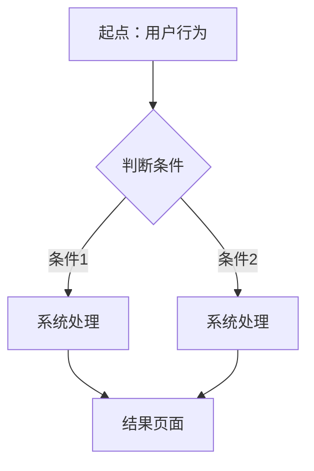
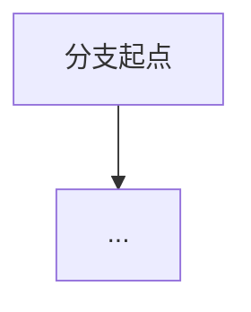

# [功能/产品名称] - PRD

> 生成时间：[日期] | 状态：初稿 / 评审中 / 已确认

---

## 1. 概述

### 1.1 一句话说明
> [动词开头，一句话说清楚做什么、给谁用、解决什么问题]

### 1.2 背景
- 业务背景：[为什么现在要做这个]
- 现状痛点：[现在的方案有什么问题]
- 相关决策：[历史沟通中已确定的结论，注明来源]

### 1.3 目标
| 目标类型 | 具体描述 | 衡量指标 |
|---------|---------|---------|
| 业务目标 | | |
| 用户目标 | | |
| 技术目标 | | [可选] |

---

## 2. 用户故事

> 格式：作为 [角色]，我想要 [功能]，以便 [价值]

| # | 角色 | 想要 | 以便 | 优先级 |
|---|------|------|------|--------|
| US-1 | | | | P0/P1/P2 |
| US-2 | | | | |
| US-3 | | | | |

---

## 3. 功能清单

### P0 - 必须有（MVP）

#### 3.1 [功能名称]
- **描述**：[动词开头]
- **业务规则**：
  - [规则1]
  - [规则2]
- **前置条件**：[需要什么条件才能使用]
- **预期结果**：[操作完成后的系统状态]

#### 3.2 [功能名称]
- **描述**：
- **业务规则**：
- **前置条件**：
- **预期结果**：

### P1 - 重要（第二期）

#### 3.x [功能名称]
- **描述**：
- **备注**：[为什么放第二期]

### P2 - 优化（后续）

- [功能点列表]

---

## 4. 用户流程

### 4.1 主流程



**步骤说明**：
| 步骤 | 用户操作 | 系统响应 | 备注 |
|------|---------|---------|------|
| 1 | | | |
| 2 | | | |
| 3 | | | |

### 4.2 分支流程（如有）



---

## 5. 页面说明

### 5.1 [页面名称]

**页面用途**：[一句话]

**页面结构**：
```
┌─────────────────────────────────┐
│           顶部导航 / 标题         │
├─────────────────────────────────┤
│                                 │
│          主内容区                 │
│          [描述布局]               │
│                                 │
├─────────────────────────────────┤
│          底部操作栏               │
└─────────────────────────────────┘
```

**元素清单**：
| 元素 | 类型 | 说明 | 交互 |
|------|------|------|------|
| | 按钮/输入框/列表/... | | 点击/输入/滑动/... |

### 5.2 [页面名称]
[同上结构]

---

## 6. 数据 & 字段说明

### 6.1 核心数据模型

```
[模型名称]
├── 字段1 (类型) - 说明
├── 字段2 (类型) - 说明
└── 字段3 (类型) - 说明
```

### 6.2 字段详情

| 字段名 | 类型 | 必填 | 校验规则 | 默认值 | 示例 |
|--------|------|------|---------|--------|------|
| | string/number/boolean/date/... | Y/N | | | |

### 6.3 接口概要（如适用）

| 接口 | 方法 | 路径 | 入参 | 出参 | 备注 |
|------|------|------|------|------|------|
| | GET/POST/PUT/DELETE | | | | |

---

## 7. 异常流程 & 边界情况

| # | 场景 | 触发条件 | 系统行为 | 用户提示 |
|---|------|---------|---------|---------|
| E-1 | | | | |
| E-2 | | | | |
| E-3 | | | | |

---

## 8. 验收标准

> 每条标准必须可测试、可验证

### 功能验收
- [ ] [具体的、可执行的验收条件]
- [ ] [包含数值的性能标准，如适用]

### 边界验收
- [ ] [异常情况的处理验证]

### 兼容性（如适用）
- [ ] [设备/浏览器/系统版本要求]

---

## 9. 待确认事项

> 信息不足、需要进一步确认的问题

| # | 问题 | 相关方 | 影响范围 | 状态 |
|---|------|--------|---------|------|
| Q-1 | [待确认: 具体问题] | [谁来确认] | [影响哪个功能] | 待确认 |

---

## 附录

### A. 信息来源
| 来源 | 类型 | 日期 | 关键信息 |
|------|------|------|---------|
| [来源1] | 邮件/会议/文档 | | [提取了什么信息] |

### B. 术语表（如有专业术语）
| 术语 | 定义 |
|------|------|
| | |

### C. 修订记录
| 版本 | 日期 | 修改内容 | 修改人 |
|------|------|---------|--------|
| v1.0 | [日期] | 初稿（AI 生成） | |
